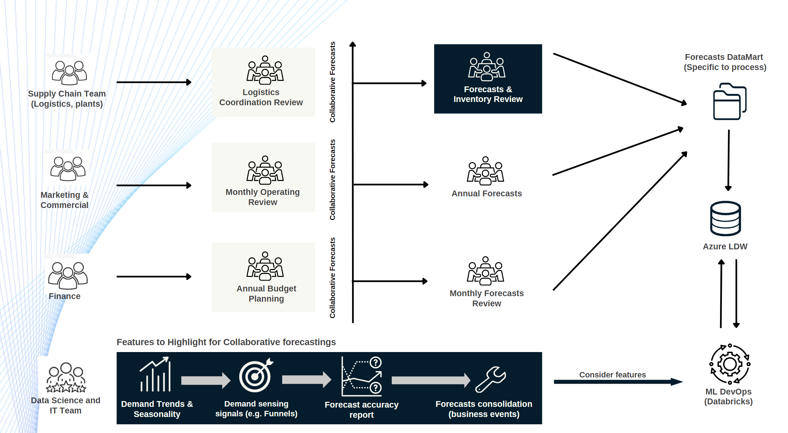

### Integrated Business Forecasting Process Flow

#### Incorporating ML into the core of both upstream and downstream forecasting processes

Data scientists and predictive forecasting systems developed through the program act as a bridge between raw data and actionable insights. They ensure that each team is able to access accurate, timely, and relevant forecasts to guide their planning process. This is key to driving adoption of machine learning.

---

[//]: # (**<Image will be added>**)

### Collaborative Forecasting

**Collaborative forecasting** is necessary to provide relevant forecasts for each team or department, as they require different KPIs/measures. For example, during the monthly operating review, the marketing and commercial teams may look at demand sensing signals, such as the movement of sales funnels, while the supply chain team's forecasts and inventory review will require a breakdown of detailed forecast performance by individual SKU/product group levels.

During the initial stage of the project, the role of the DS team will be to drive **collaborative forecasting** and promote the adoption of machine learning.

As features are refined and comments/inputs are provided to the DS team from respective teams, additional tweaks can be made to the ML models. The process of **forecast consolidation** is required based on the inputs from the businesses, leading to additional FA% gain.

As the process matures, training and capability building efforts will be required to push the adoption and automate the discussion flow. This provides an opportunity for the DS team to focus on further refinements and make the system scalable to serve expanded geographies beyond Asia.
