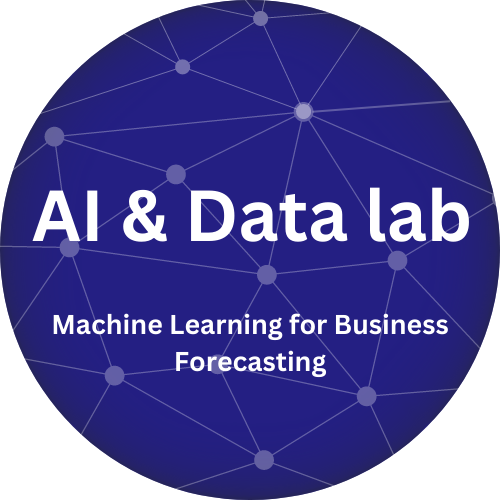

Joint Research Labs funded by Nanyang Technological University and Becton Dickinson

### Leadership and Team

**Program Lead / PI:** Suhwan Chung (BD), Professor Jagath Rajapakse (NTU)

**Steering Committee (BD):** Min Yuan Seow, Raymond Chow, Paul Holt

**Project Team (BD):** Sally Shen, Justin Lau, Ying Nan, Wan Sian, Gary Chong, Kenneth Lim, Rebecca Neiw, Kavi Lognathan, Meeyee Wong

**Project Team (NTU):** ChungSoo Ahn, Yousheng, Tziyong, Raghav Mantri

**Raymond Chow**
*(VP/GM, Central Asia)*

BD and NTU have had numerous partnerships wherein most of these, BD has been providing technology eg. flow cytometry for research. For this collaboration, it will be NTU sharing their expertise in machine learning and helping work out a solution for how we can optimally predict and forecast products for manufacture and distribution

***Min Yuan Seow***
(VP Global Logistics & Distribution)
“The collaboration will help accelerate BD’s plan to build expertise in-house. It will also expose BD associates to best-in-class of data science research. I look forward to this collaboration to enhance the quality of our sales and operations planning that will greatly enhance BD’s competitiveness.”.

# Program Initiative

### How can we improve forecast accuracy?

## Overview

The COVID-19 pandemic has resulted in a significant global crisis that disrupted the supply chains. Many companies are exploring new technologies to address challenges associated with demand forecasting as market volatility, complexities, and rising standards in healthcare treatment.
We have learned from this crisis to constantly correct and analyze the dynamic changes that is affecting the industry, where we need to manage inventory due to sales volatility or to optimally improve production and distribution due to demand surge of products that are directly in high demand during the pandemic. (e.g., vaccination needles, BD Veritor CoV2 diagnostic tests, etc.)

The robust forecasting framework that utilizes state-of-the-art computational intelligence techniques will unlock the potential technologies to detect risks and opportunities imposed by the new era. This will not only provide private enterprises like BD with greater accuracy in planning production/supplies, delivery, and R&D activities but also lead to generating added intelligence across the global market.

## Projects Rolled Out Through This Program

### [1] Sustainable Infrastructure and Architecture for ML Applications

[Data Architecture and Infrastructure Page](/data-architecture-and-infrastructure)

### [2] Build Scalable Machine Learning for E2E Forecasting

[Machine Learning Page](/machine-learning)

### [3] Driving ML Adoption and Change Management
[Change Management Page](/change-management)
