<!-- Color scheme: Black:#002142, Dark Blue: #1B11E9, Ger: #A7A9AC, Green: #008080 -->

# <span style="color: #002142;"> Portfolio 🚀</span>

Welcome to my portfolio. Below are the key projects and models I've worked on. Navigate through the sections to explore the details.

<br/>
<br/>

## Projects
1. [Two-Stage Meta Learning using Reptile](#two-stage-meta-learning-reptile)
2. [DataMeka Competition](#datameka-competition)
3. [Generative AI in DataMeka](#datameka-genai)
4. [Transforming Supply Chain Operations](#bdntu)

<br/>
<br/>


## <span id="two-stage-meta-learning-reptile" style="color: #008080;">A scalable meta-learning algorithm for time-series</span>

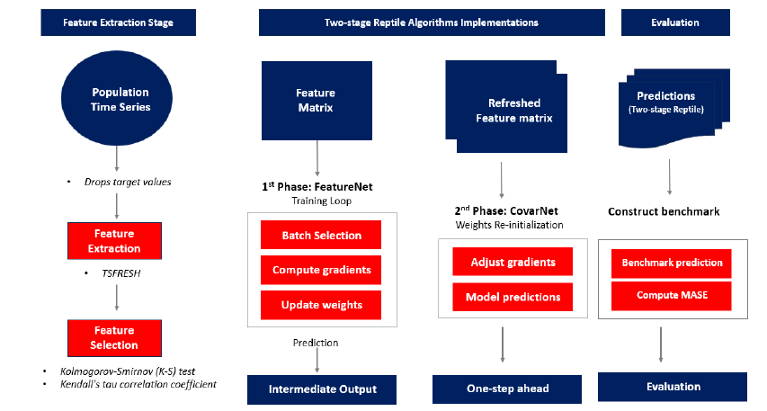

In **predictive forecasting**, **high variability** and **small sample sizes** for training models pose significant challenges. To address this issue, I'm excited to introduce a scalable meta-learning algorithm designed for time-series forecasting, inspired by variations of OpenAI's Reptile algorithm. Essentially, we’re training neural networks (FeatureNet) to extract transferable features across different univariate series. The second networks (FineTuneNet) refine final outputs for numeric predictions. The pseudocode is as follows:

```text
Initialize Φ, the initial parameter vector
for iteration 1, 2, 3, … do
  Randomly sample a task T
  Perform k > 1 steps of SGD on task T, starting with parameters Φ, 
  resulting in parameters W
  Update: Φ ← Φ + ϵ (W − Φ)
end for
Return Φ
```

As an alternative to the last step, we can treat Φ − W as a gradient and plug it into a more sophisticated optimizer like Adam⁠.

### Implementation:
1. **FeatureNet (Stage 1):**  
   Construct **FeatureNet** neural networks. Initially, the model is exposed to a range of sub-tasks (ie uni-variate series) starting with its global weights defined by activating *He initialization*. The model then enters a training phase for each task with univariate, mini-batch subset. The training is run in a way to minimize the forecast errors using constructed feature matrix of expressed features. Here's the list of expressed features:
   
   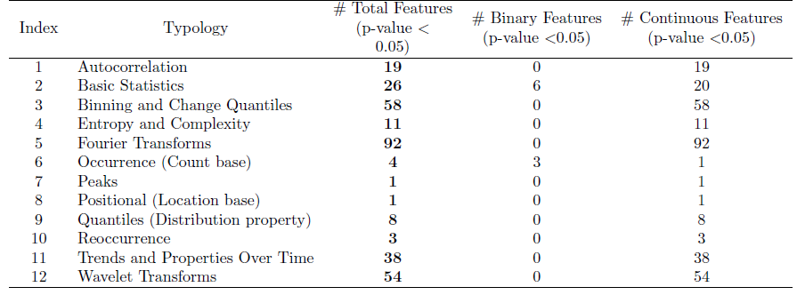

2. **FineTuneNet (Stage 2):**  
   Construct additional network **CovarNet** that uses **few-shot learning** frameworks to incorporate learned feature representations from the initial training phase. In contrast to the first phase, which employs the feature matrix
   to generate intermediate output of a vector of numeric forecasts, the second phase take into account the intermediate prdictions from the first phase as well as the whole historical values. Refer to [few-shot learning here](https://www.ibm.com/topics/few-shot-learning)

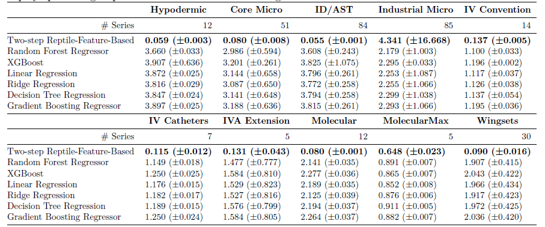
The outcomes from the two-step meta-learning shows an improvement over the benchmark. We evaluate all predicted outcomes for time-series which is out of sample using a consistent forecast horizon.

*This research paper is currently under review. Once approved, it will be distributed along with code for implementation.*

<br/>
<br/>
<br/>
<br/>

## <span id="datameka-competition" style="color: #008080;">DataMeka: Machine Learning Playground for Southeast Asia</span>

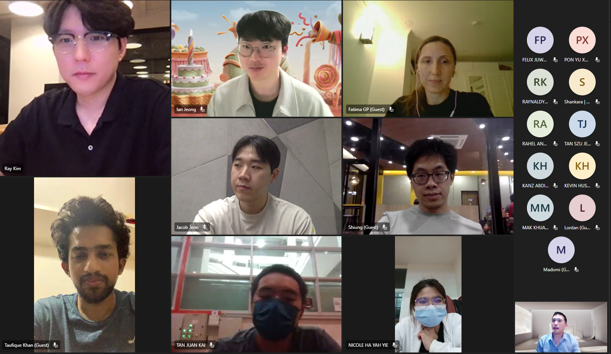

During my PhD, I created a **machine learning playground** focused on South Asian issues. Topics included predicting **Singapore housing prices**, analyzing deforestation drivers in Indonesia, and breaking down strategies in Asian e-sports FPS games. Here's resources to key compeititions we hosted.

- **Singapore Housing Price Prediction:**  
   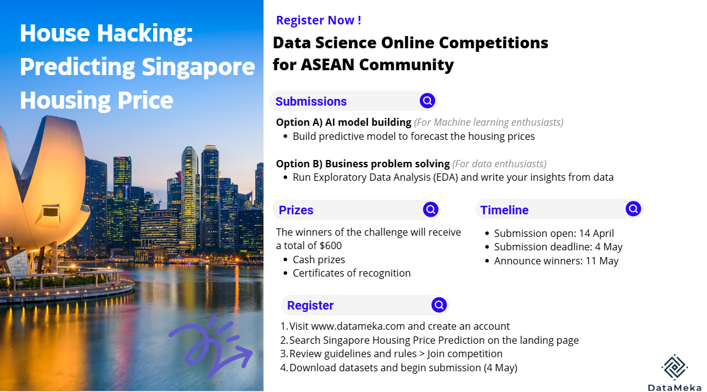  
   The price escalation has become a significant issue for those seeking residence. This competition is to predict the short-and-long term housing price of Singapore.
   - [Watch competition tutorial on YouTube](https://www.youtube.com/watch?v=rpW8Mlf86k0)
   
   **Visual incorporated winning ML models developed through compeititons:**  
   <iframe src="./image/datameka-html.html" width="100%" height="600px" frameborder="0"></iframe>

<br/>

- **Indonesia Deforestation Prediction using Satellite Images:**  
   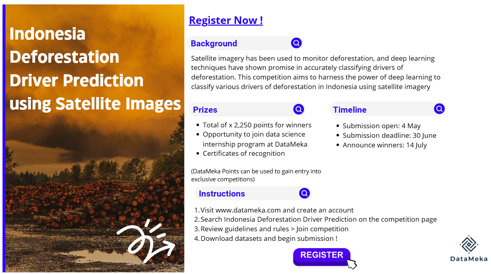
   In Indonesia, satellite imagery has been used to monitor deforestation, and deep learning techniques have shown promise in accurately classifying drivers of deforestation. This competition aims to classify various drivers of deforestation using satellite imagery

<br/>

- **Thailand CO2 Emission Prediction:**  
   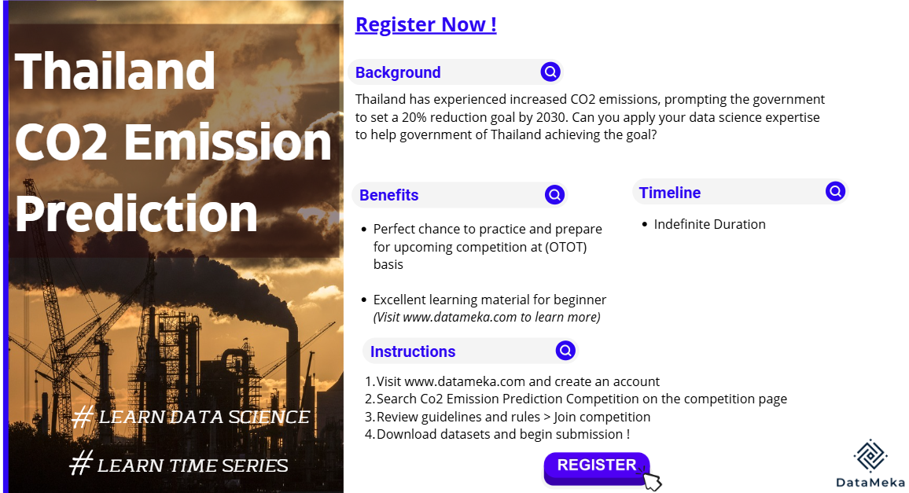
   Thailand has experienced increased CO2 emissions and government has set a 20% reduction goal by 2030. This competition aims to build state-of-the-art forecasitng models for predicting CO2 emission.
   
<br/>

- **E-sports x AI:**  
   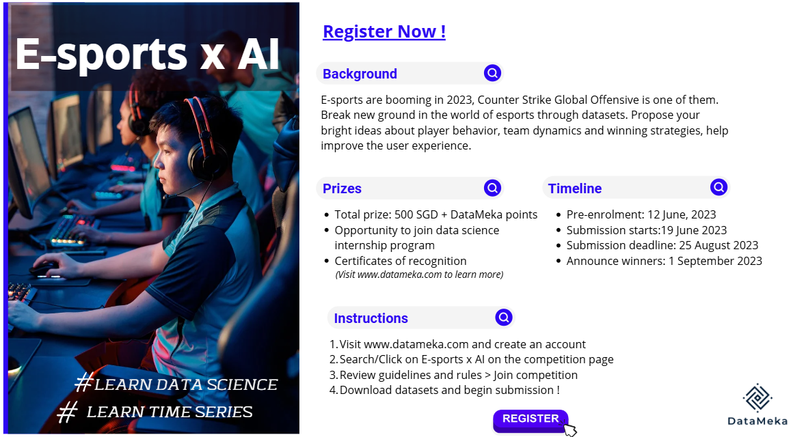  
   *Counter Strike* is one of the most popular FPS game in Asia. This competition is to propose ideas about player behavior, team dynamics and winning strategies and help improve the user experience using range of algorithms from rule-based to deep learning

   

   Show real-time win/loss probabilities. The colors represent opposing teams (blue vs red), taking into account strategic positions on the map and how they affect the win/loss probability of each party.

<!-- </details> -->

<br/>
<br/>
<br/>
<br/>

## <span id="datameka-genai" style="color: #008080;">Generative AI in DataMeka</span>
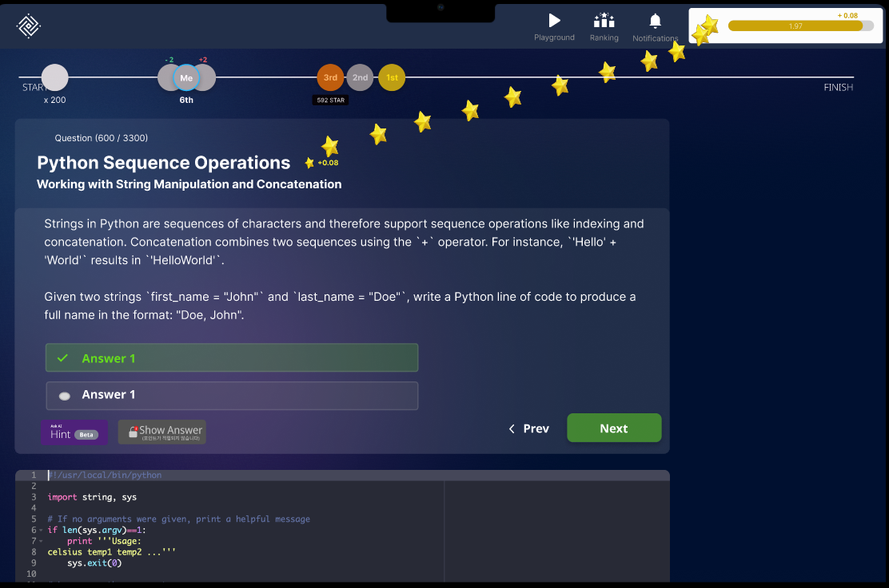
At DataMeka, we piloted a Generative AI feature to provide free learning content on our website along with competitions. Think of it as "Hack the Box" for data science and machine learning. We brought this vision to life using Azure OpenAI and extensive prompt engineering experiments to build interactive quizzes for practicing codes for machine learning.

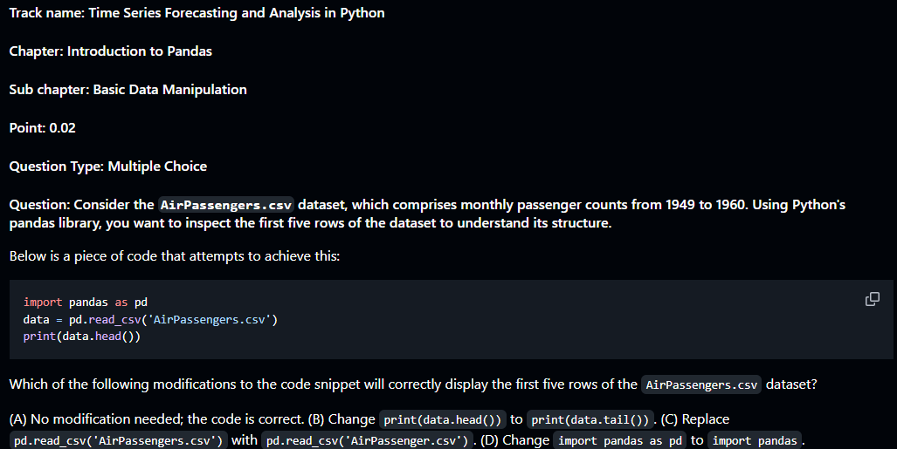

Unfortunately, the platform didn’t make it to a public go-live. The costs of Azure OpenAI, especially for sending and receiving prompts by users real-time became a major roadblock. On top of that, the storage limits of Azure SQL for storing quiz and user logs without scaling to commercial plans made our project unsustainable. However, here's a summary of key lessons learned in GenAI app development:

   1. **Prompt engineering is everything for GenAI**: High quality quiz generation depended on how well the prompts were formulated after hours of experimentations. Consistency in prompts was key so that the AI-generated quizzes aligned with the learning objectives. Any deviation in prompt structure could throw the whole thing off track. 

   2. **Prompt variations for Different Question Types**: In my experience, GenAI is exceptionally good at creating high quality quiz contents for learning coding. We could make it even more powerful by variating the prompt in a way that AI could adjust question complexity based on user performance (if a user answered incorrectly, you could prompt it to increase the complexity in subsequent quizzes)


<br/>
<br/>
<br/>
<br/>

## <span id="bdntu" style="color: #008080;">Transforming Supply Chain Operations with Machine Learning</span>

<!-- <iframe src="./image/bdntu-news.pdf" width="600" height="500" allow="autoplay"></iframe> -->
Becton Dickinson partnered with Nanyang Technological University to optimize **demand forecasting** and **inventory management** using AI/ML. My role involved leading the project team, overseeing the project, and brining research deliverables into production. 

### Grouped Pattern Analysis using Deep Embedded Clustering:
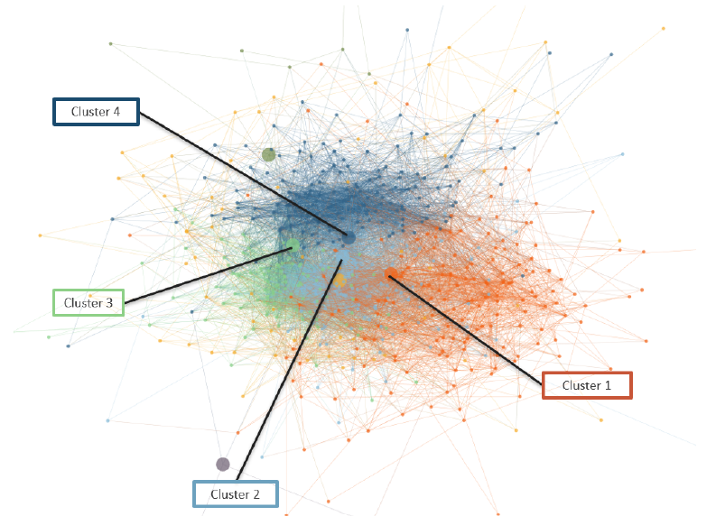
The primary challenge in demand forecasting is the prediction of weak predictors with limited historical data, which can result in inaccurate forecasts for newer products or products with volatile demand. Traditional forecasting models often perform well with strong predictors but struggle with weaker ones. The objective of this research is to enhance the accuracy and stability of weak predictors by leveraging sales patterns of related product groups through feature extraction and clustering techniques.

The study uses 2-step routine:
- **Feature Extraction**: Extract meaningful features from time-series to capture underlying characteristics.
- **Clustering**: Different techniques are experimented including Deep Embedded Clustering (DEC) and Network Cluster using Louvain. Here's example of time-series segments by DEC.

   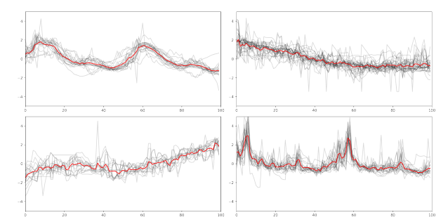

In the figure below, time-series is split into 4 categories by their respective quantiles, strong (top 10%), good (10-30%), average (30-60%) and weak (60-99%) predictors. The red line shows the baseline model results, while the orange line shows the actual forecast accuracy calculated by MASE.

   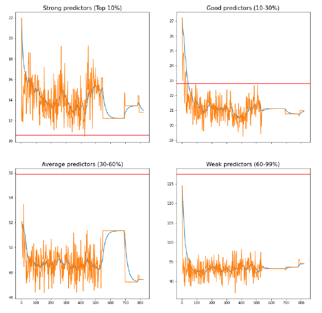

The blue line shows the smoothed curve of the forecast accuracy, which shows that after around 160 feature space, feature space expansion does not help improve accuracy. Using the red line as the benchmark, we can see that the clustering model significantly improves the results as the predictor is weaker, while being a detrimental effect to the strong predictors. 

<br/>

### Capture Demand Sensing Signals for forecasting
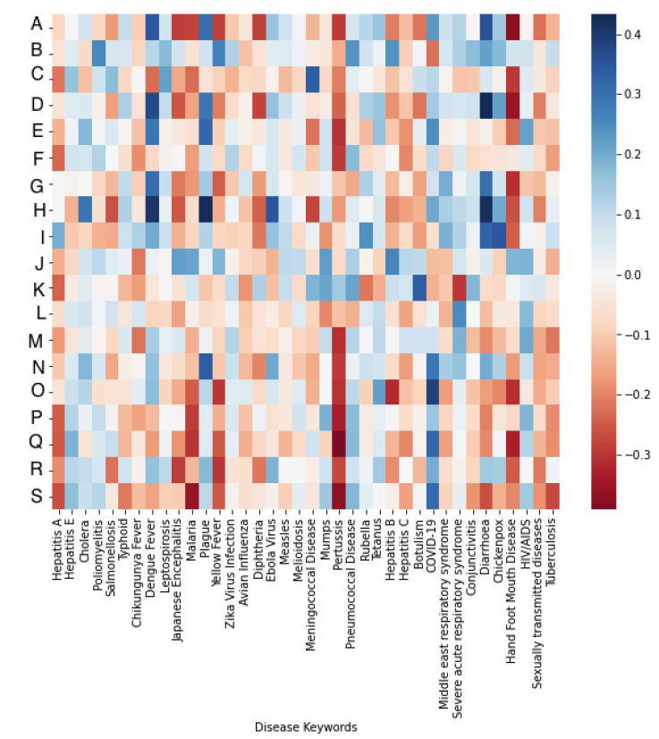
In the medical supply chain, finding demand sensing signals that simulate external environmental factors is critically difficult due to volatile patterns and limited internal data availability. This research aims to improve demand forecasting accuracy by incorporating external variables—specifically Google Trends keywords related to diseases—into forecasting models. The objective is to identify the most relevant keywords using various feature selection methods and use them as predictive signals. 

1. **Implementations**:
   We obtained disease-related keyword trends from Google Trends. To increase the relevance of keywords to the demands for medical products, this research conducted preliminary research to identify which products are used for specific disease treatments. We selected diseases common in Singapore based on published data from the Ministry of Health of Singapore. A few search keyword trends used are:
   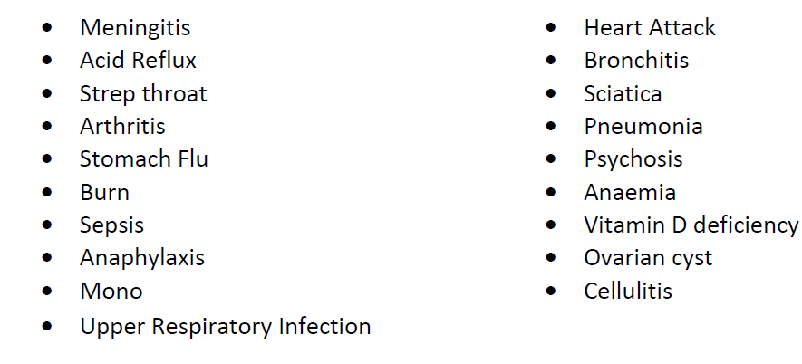

   In this study, (1) Pearson’s Correlation (2) Lasso Regression, (3) Recursive Feature Elimination were experimented to measure the linear relationship between each keyword and historical demands to identify strong correlations. Additionally, this research also explore time series characterization to compare the structural behaviors of historical demand patterns and Google search trends:
   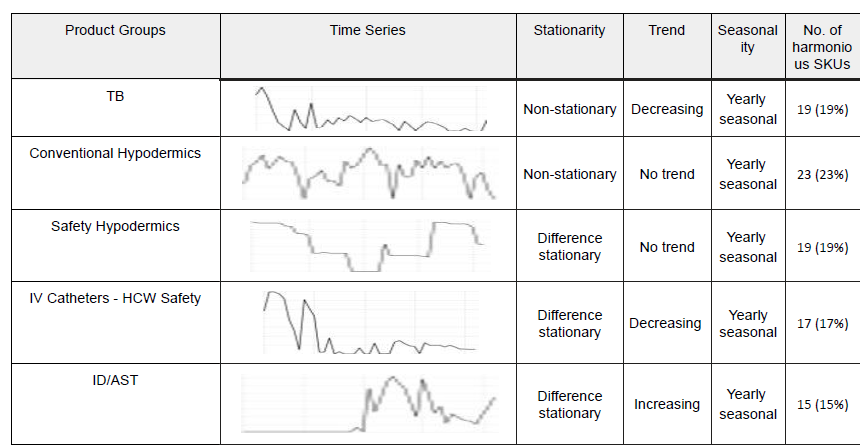

2. **Results**:
   The research highlighted **Pearson’s correlation** as the most effective feature selection method across multiple target series. Also, from forecast accuracy standpoint, Pearson’s method outperformed both Lasso and RFE with Linear Regression and XGBoost. A key takeaway from the study was that the inclusion of external variables, such as Google Trends data, help improve forecast accuracy for most medical products experimented in this research.