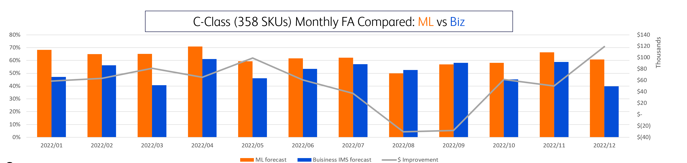
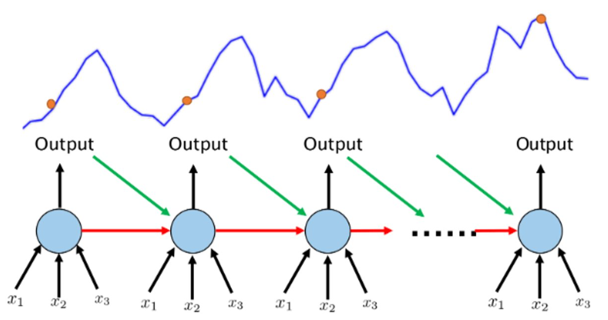
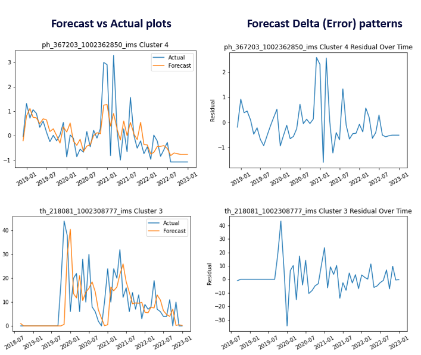
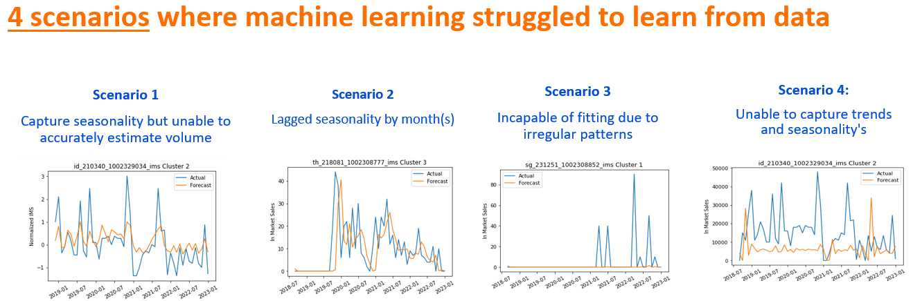

### Problem Statement for Algorithm-driven Forecasting

Today's demand forecasting solutions rely solely on historical trends and do not take into account uncertain market factors. This often results in inaccurate demand forecasting for certain products, leading to excess and/or stockouts.

---

### Objective for Machine Learning

Build a scalable and production-ready machine learning solution for forecasting distributor demand. This will lead to improved forecast accuracy and optimized inventory. Utilize various external data points and establish correlations with demand planning.

---

### Machine Learning Benefits Highlights

- Forecasting accuracy improvements by 15-20%
  Reduction in E&O (Excess & Obsolete) by 50% vs PY (average) . Expected value: ~$400-500k savings
- Lower human bias in overall demand forecasting process with a pure data driven approach
- Enhance what-if scenario planning tool and integrate to predictive capability.

---

### Machine Learning Workflow Overview
[//]: # (**<Architecture image will be updated and added>**)

Key Components:

**1. Input Data Sources**: The workflow integrates diverse data sources:
- **Internal Data**: Channel data and historical sales, customer orders.
- **External Data**: Demographics, healthcare expenditures, NCD & CD from authoritative sources like Government/WHO.
**2. SKU/Product Clustering**: Products are clustered based on criteria like:
- Volatility (High, Medium, Low)
- Top revenue contributors
- Product lifecycle

This clustering is further combined with business inputs.

**3. M/L Modellings**: The project introduces four distinct pipelines, each tailored for specific data combinations and forecasting models:
- **Cluster-based Pipeline**: This pipeline incorporates 10 distinct forecasting models tailored for each cluster’s unique characteristics and focuses on leveraging the hidden patterns (e.g. volatility, seasonality) available in the other series, using the clusters identified in the SKU/Product Clustering phase.
- **AutoML Pipeline**: This pipeline leverages automated machine learning to rapidly test and deploy optimal models.
- **Deep Learning Pipeline**: Concentrates on using deep neural networks, suitable for complex datasets and non-linear relationships.

   

**4. Front-end User Interface**: Comparisons between M/L Forecasting and Business forecast are visualized for user insights.

**5. Integration**: The ML workflow seamlessly integrates with various tools:
- Planning tools
- "What if" tools for scenario analysis
- Planning dashboards

---

### Descriptions of the Phases of the ML Workflow

1. **Development:** This is the initial phase of the workflow, where the forecasting system is set up and designed. The focus is on creating machine learning framework and planning out key features.
2. **Iterative Validation & Testing:** This phase is characterized by continuous improvements based on feedback loops. The focus is on making incremental changes to the models, based on user feedback and accuracy, to ensure that the final solution meets the desired specifications.
3. **Integration & Automation:** This is the final phase of the workflow, where the system is tested and integrated with other tools. The goal is to ensure that the ML system works autonomously and seamlessly integrates with other tools.

---

### Lessons learned and Caveats

Model Diversity and Automating Model Selection

Using a combination of machine learning and statistical models enables flexibility and improved forecasting for different product clusters. Automating the forecasting model selection process minimizes forecast errors and ensures that new models are utilized every cycle at their best.

**User Interface Importance**

Having a front-end that effectively communicates the forecasts versus actual demands (sales) is key to gaining stakeholder buy-in. Instead of blindly showing the algorithm results, it would be helpful to include key planning KPIs such as "products at risk of stockouts" and "continuous success over historical planning window" to further support the buy-in process.